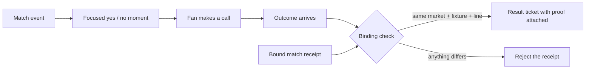

<p align="center">
  
</p>

<h1 align="center">Roar Markets</h1>

<p align="center">
  <strong>Call the next match moment. Keep its proof attached.</strong><br>
  A fan-first World Cup prototype for quick yes-or-no picks whose result stays bound to the exact fixture and line.
</p>

<p align="center">
  <a href="https://roar-markets.vercel.app"></a>
  
  
  
  
</p>

<p align="center">
  <strong><a href="https://roar-markets.vercel.app">Open the live Roar Markets match experience →</a></strong>
</p>

## The problem

Live-match predictions are easy to show and hard to trust. A fan can tap a choice, watch a result appear, and still
have no durable answer to a basic question: did that result come from the same match and line they originally saw?
An operator-controlled verdict can silently lose its context.

Roar Markets treats the context as part of the result. The fixture, market, line, and answer travel through one
fail-closed binding check. A receipt for another match or another total cannot be substituted and presented as if it
belonged to the fan’s call.

## What Roar Markets does

- **Turns match events into focused fan calls.** The interactive board opens a simple “another goal?” moment after a
  score change, with no wallet or account setup.
- **Keeps the question readable.** Teams, score, minute, and line stay visible while the fan chooses yes or no.
- **Returns a result ticket, not a detached verdict.** The walkthrough joins the pick, outcome, fixture, and line in
  one shareable card.
- **Checks an actual historical receipt in the browser.** A separate progressive proof panel reads a Solana devnet
  account and validates its owner, type, derived address, embedded market, fixture, line, and outcome.
- **Fails closed when evidence does not match.** Wrong-market, wrong-fixture, wrong-line, malformed, foreign-owner,
  missing, and divergent-provider cases do not earn a verified state.
- **States the edge of the prototype.** Receipt binding is demonstrated; payout, refunds, custody, disputes, and the
  policy that decides match finality are not.

## How it works



The browser experience has two intentionally separate rails. The match interaction is a deterministic, device-local
walkthrough so anyone can complete the story in seconds. The historical proof rail reads a real devnet receipt and
runs the same complete binding gate used by the TypeScript consumer. The walkthrough never borrows the historical
receipt’s evidence label.

## Product surface

| Fan question | What is bound | Current proof status |
| --- | --- | --- |
| Another goal after the score changes? | market + fixture + 1.5-goal line + outcome | Interactive walkthrough; deterministic gate |
| Over or under 1.5 / 2.5 / 3.5 goals? | each total is independently line-bound | Factory and wrong-line regression tests |
| Both teams to score? | market + fixture + BTTS outcome | Consumer layout and fail-closed tests; no live receipt minted |
| Historical Under 2.5 result | market + fixture `17588395` + line `2.5` + `NO` | Real Solana devnet receipt, readable in browser |

Roar Markets is goal-grain by design in this prototype. It does not claim per-second markets, a full sportsbook, or
profit-and-loss performance.

## Live evidence and walkthrough

Open [roar-markets.vercel.app](https://roar-markets.vercel.app) for the shortest path:

1. Select **Open the next call** on the Argentina–France match card.
2. Pick **Yes** or **No**, then reveal the match result.
3. Inspect the returned ticket: match, line, call, and outcome remain together.
4. Scroll to **Open the historical match proof** and run the live browser check.
5. Expand **Inspect the exact binding checks** only if you want the underlying addresses and decoded fields.

The historical evidence chain is public on Solana devnet:

| Evidence | Public artifact |
| --- | --- |
| TxLINE goal-total proof accepted by `txoracle` | [transaction `5k69…LCkpr`](https://explorer.solana.com/tx/5k69yoynmmieNqHNDpzCqozvffz8mKk8zwqZ7XTpDULSKwqGDLKQDZbkxkSvRoSrDd74teiDScQa1VyWuTPLCkpr?cluster=devnet) |
| Bound Under 2.5 receipt minted by `kickoff_oracle` (`34FXjUuikioZy4fcUKSoP9NVW7WWKQnpJUZQcRDTNLtw`) | [transaction `4Czq…kufAG`](https://explorer.solana.com/tx/4CzqNgSp26tCbZ5NQx6mCErRQVHaZamScwD4JvTNmdo2Q885y2fHDtCqVfdyp8NDg7uajM2CsWMLrTvi1Z7kufAG?cluster=devnet) |
| Receipt read by the browser | [account `39vT…QiX6n`](https://explorer.solana.com/address/39vT6hs7hmqcQ3oaQ3AgCMJrdX2dz5973hhoffVQiX6n?cluster=devnet) |
| Decoded result | fixture `17588395` · Under 2.5 · `NO` |

The UI first reads the receipt from the public devnet RPC and attempts a second independent provider. Two matching
reads are the strongest UI state; one available provider is labeled as such, and disagreement is shown as a failure.
RPC agreement is still not a cryptographic light-client proof, so the explorer link remains available for an
independent comparison.

## Reproduce it

Prerequisites: Node.js 18 or newer and npm. Clone the future public repository path, install locked dependencies, and
run the complete deterministic gate:

```bash
git clone https://github.com/kamenev72/roar-markets.git
cd roar-markets
npm ci
npm --prefix ui ci
npm run judge-demo
```

`judge-demo` runs the TypeScript tests, root and UI type checks, production Vite build, initial-bundle budget,
Playwright checks at 360 / 768 / 1440 pixels, clean-room checks, documentation drift checks, and the XSS sink guard.
It does not make the historical RPC request; that live read belongs to the browser experience.

For a local product session:

```bash
npm --prefix ui run dev
```

For the same historical receipt check in a terminal:

```bash
node --import tsx scripts/verify_real_settle.ts
```

## What is real and what is simplified

| Real and reproducible | Simplified or outside scope |
| --- | --- |
| A historical `OuBoundReceipt` exists on Solana devnet. | The hero match and its reveal are a local walkthrough. |
| The browser re-derives and checks the expected receipt binding without a wallet or API key. | The walkthrough does not initialize a live public venue. |
| Wrong owner, type, address, market, fixture, line, or outcome fails closed in tests. | No public payout, refund, custody, dispute, or void path is shown. |
| The total-goals factory and consumer are deterministic and regression-tested. | The private/injected hook’s finality timing is not proven. |
| The browser distinguishes 2-provider agreement, 1-provider reads, divergence, and failure. | Public RPCs are trusted data sources, not an SPV or light-client proof. |
| The venue ABI is validated locally against the vendored program binary. | No live venue-initialization transaction is claimed. |

The security model and exact non-claims live in [SECURITY.md](SECURITY.md) and [CLAIMS.md](CLAIMS.md). The complete
historical evidence record is in [evidence/real_onchain_settle.md](evidence/real_onchain_settle.md).

## Repository layout

```text
ui/          React + Vite fan experience and browser receipt checker
src/         market factory, pricing helpers, receipt layouts, and binding consumer
test/        deterministic factory, binding, evidence-state, and edge-case coverage
scripts/     reproduce, bundle, clean-room, documentation, and release checks
evidence/    committed historical receipt record and responsive UI captures
fixtures/    vendored venue binary and ABI provenance
docs/        TxLINE integration notes
```

Some package and storage identifiers retain a historical internal codename for compatibility. **Roar Markets is the
only public product name.**

## License

Apache License 2.0. See [LICENSE](LICENSE) and [NOTICE](NOTICE).
