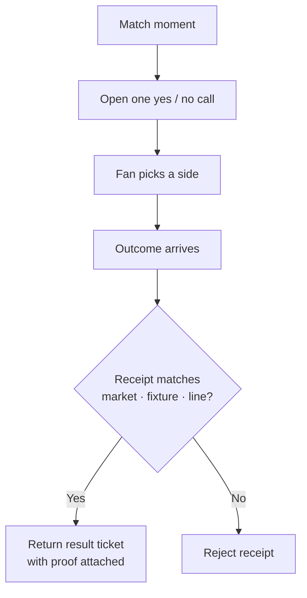

<p align="center">
  
</p>

<h1 align="center">Roar Markets</h1>

<p align="center"><strong>Call the next match moment. Keep its proof attached.</strong></p>

<p align="center">
  <strong>Every fan app asks you to trust their referee.<br>Roar Markets checks the receipt in your own browser instead — no wallet, no sign-up.</strong>
</p>

<p align="center">
  <a href="https://roar-markets.vercel.app"></a>
  
  
  
  
</p>

<p align="center">
  <strong><a href="https://roar-markets.vercel.app">▶ Open the live app →</a></strong>
  &nbsp;·&nbsp; <code>bash scripts/demo.sh</code> runs the whole thing
</p>

---

## Run it yourself (one command)

Don't take our word for it — run the gate. Clone, install once, then run the one-shot demo take:

```bash
git clone https://github.com/kamenev72/roar-markets.git
cd roar-markets
npm ci && npm --prefix app ci     # one-time install
bash scripts/demo.sh              # the verified one-shot demo take
```

In about a minute you'll watch:

- ✓ **the gate go green** — tests · typecheck · initial-bundle budget · responsive browser gate · clean-room · doc-drift
- ✓ **a real Solana devnet receipt re-verified live in your terminal**, through the complete binding gate — no API key, read-only (PDA `39vT6hs7…`)
- the launch line for the phone-first fan board

Starting from a cold machine with nothing installed? `bash scripts/judge_setup.sh` installs every dependency and runs the full `npm run judge-demo` gate in one shot.

## See it live

- **Live app:** [roar-markets.vercel.app](https://roar-markets.vercel.app) — phone-first, runs in your browser, nothing to install.
- **Demo video:** _<!-- add link before submission -->_

## The problem

Sports-prediction apps are fast to play and impossible to audit. You tap a pick, a result appears, and a server tells you who won — but you can never check that the outcome is bound to the exact market, fixture and line you actually called. Settlement stays a black box you're asked to trust.

## What makes it different

Roar makes that check the product. Every resolved call carries a receipt that binds **market · fixture · line · outcome**, and the fan's own browser re-derives and re-checks that binding — client-side and **fail-closed**. A receipt for another match, or another total, can't be swapped in and passed off as your call.

> **Don't trust our resolver — re-check ours.**

In the fan-track entries we inspected (2026-07-19), settlement verification runs on someone's server or is backend-signed. Across the 279-repo field we surveyed (code-scanned census, n=100), Roar is the entry we found where the re-check runs in the fan's own browser. We claim no format exclusivity — the measured difference is a **browser-visible receipt-binding re-check** with honest evidence-strength states.

## Proof, not marketing

| What | Evidence |
| --- | --- |
| Live, public app | [roar-markets.vercel.app](https://roar-markets.vercel.app) on Vercel |
| A real on-chain receipt, re-checked in-browser | Solana **devnet** · fixture `17588395` · Under 2.5 · `NO` · account `39vT…QiX6n` |
| Test coverage | **197 Vitest + 15 Playwright** at 360 / 768 / 1440 px · initial bundle under budget |
| One command runs the entire gate | `bash scripts/demo.sh` (full gate: `npm run judge-demo`) |

The historical evidence chain is public on Solana devnet — verify it independently in an explorer:

| Evidence | Public artifact |
| --- | --- |
| TxLINE goal-total proof accepted by `txoracle` | [transaction `5k69…LCkpr`](https://explorer.solana.com/tx/5k69yoynmmieNqHNDpzCqozvffz8mKk8zwqZ7XTpDULSKwqGDLKQDZbkxkSvRoSrDd74teiDScQa1VyWuTPLCkpr?cluster=devnet) |
| Bound Under 2.5 receipt minted by `kickoff_oracle` (`34FXjUuikioZy4fcUKSoP9NVW7WWKQnpJUZQcRDTNLtw`) | [transaction `4Czq…kufAG`](https://explorer.solana.com/tx/4CzqNgSp26tCbZ5NQx6mCErRQVHaZamScwD4JvTNmdo2Q885y2fHDtCqVfdyp8NDg7uajM2CsWMLrTvi1Z7kufAG?cluster=devnet) |
| Receipt read by the browser | [account `39vT…QiX6n`](https://explorer.solana.com/address/39vT6hs7hmqcQ3oaQ3AgCMJrdX2dz5973hhoffVQiX6n?cluster=devnet) |
| Decoded result | fixture `17588395` · Under 2.5 · `NO` |

The UI reads the receipt from the public devnet RPC and attempts a second independent provider. **Two matching reads are the only green state**; one available provider is labelled as such, and disagreement is shown as a failure. RPC agreement is still not a cryptographic light-client proof, so the explorer link stays available for an independent comparison.

## How it works



The browser experience has two intentionally separate rails:

- **The fan interaction is a deterministic local walkthrough** — teams, score, minute and line stay visible while you tap yes or no, so anyone can complete the story in seconds with no wallet and no account.
- **The proof rail reads a real devnet receipt** and runs the same complete binding gate the TypeScript consumer uses. Wrong-market, wrong-fixture, wrong-line, malformed, foreign-owner, missing, and divergent-provider cases never earn a verified state.

The walkthrough never borrows the historical receipt's evidence label — the simulated flow and the real re-check are kept apart on purpose.

## Product surface

| Fan question | What is bound | Current proof status |
| --- | --- | --- |
| Another goal after the score changes? | market + fixture + 1.5-goal line + outcome | Deterministic local walkthrough; deterministic gate |
| Over or under 1.5 / 2.5 / 3.5 goals? | each total is independently line-bound | Factory + wrong-line regression tests |
| Both teams to score? | market + fixture + BTTS outcome | Consumer layout + fail-closed tests; no live receipt minted |
| Historical Under 2.5 result | market + fixture `17588395` + line `2.5` + `NO` | Real Solana devnet receipt, readable in browser |

Your own calls build a **private, device-local record card** — recent calls, accuracy, best run — that you can clear on-device and export as a share-card. It is not a rank, a reward, or a payout artifact, and it is not a public leaderboard.

This is a prototype. It does not claim per-second markets, a full sportsbook, or profit-and-loss performance. Payout, refunds, custody, disputes, and the policy that decides match finality are stated boundaries, not features shown here.

## Reproduce it

Prerequisites: Node.js 22 and npm. Linux hosts must already provide Playwright's Chromium system libraries (or use a Playwright-supported image). The setup script never invokes `sudo` on a judge machine; its CI branch provisions those host libraries with `playwright install --with-deps chromium`.

Cold, credential-free full gate:

```bash
git clone https://github.com/kamenev72/roar-markets.git
cd roar-markets
bash scripts/judge_setup.sh
```

`judge-demo` runs the Vitest suite, root and UI type checks, the production Vite build, the initial-bundle budget, Playwright checks at 360 / 768 / 1440 px, clean-room checks, documentation-drift checks, and the XSS-sink guard. It does not make the historical RPC request — that live read belongs to the browser (and to `scripts/demo.sh`).

Run the app locally:

```bash
npm --prefix app run dev
```

Re-check the same historical receipt from a terminal:

```bash
node --import tsx scripts/verify_real_settle.ts
```

Lowercase `propcast` package, storage, and domain identifiers are stable compatibility seams. **Roar Markets is the only public product/display name.**

## What is real and what is simplified

| Real and reproducible | Simplified or outside scope |
| --- | --- |
| A historical `OuBoundReceipt` exists on Solana devnet. | The hero match and its reveal are a deterministic local walkthrough. |
| The browser re-derives and re-checks the expected receipt binding without a wallet or API key. | The walkthrough does not initialize a live public venue. |
| Wrong owner, type, address, market, fixture, line, or outcome fails closed in tests. | No public payout, refund, custody, dispute, or void path is shown. |
| The total-goals factory and consumer are deterministic and regression-tested. | The injected finality hook's timing is not proven. |
| The browser distinguishes 2-provider agreement, 1-provider reads, divergence, and failure. | Public RPCs are trusted data sources, not an SPV or light-client proof. |
| The venue ABI is validated locally against the vendored program binary. | No live venue-initialization transaction is claimed. |

The full security model and exact non-claims live in [docs/SECURITY.md](docs/SECURITY.md) and [docs/CLAIMS.md](docs/CLAIMS.md). The complete historical evidence record is in [artifacts/evidence/real_onchain_settle.md](artifacts/evidence/real_onchain_settle.md).

## Repository layout

```text
app/                    React + Vite fan experience and browser receipt checker
packages/core/src/      market factory, pricing, receipt layouts, binding consumer,
                          on-chain read + venue ABI, signal/loop/metrics helpers
packages/core/test/     deterministic factory, binding, evidence-state, edge-case coverage
scripts/                demo, judge setup, reproduce, bundle, clean-room, doc, XSS checks
artifacts/evidence/     committed historical receipt record and responsive UI captures
artifacts/fixtures/     vendored venue binary and ABI provenance
docs/                   judge walkthrough, demo script, claims/honesty ledgers, TxLINE notes
```

The documentation index is [docs/README.md](docs/README.md); the shortest judge path is [docs/JUDGE.md](docs/JUDGE.md).

## License

Apache License 2.0. See [LICENSE](LICENSE) and [NOTICE](NOTICE).
