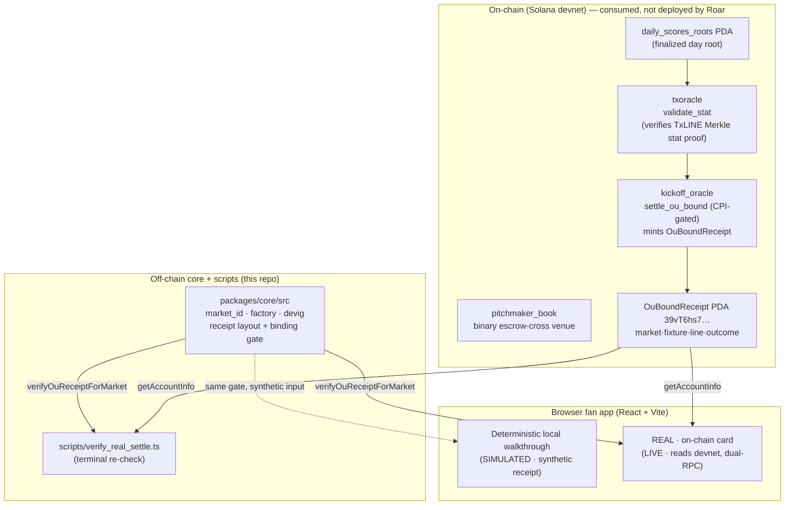

# Roar Markets — Technical Documentation

A fan-facing sports prediction prototype whose settlement you re-check in your own browser: every resolved
call carries a real Solana **devnet** receipt, and the fan's browser re-verifies that the receipt is bound to
the exact market, fixture and line that was called — no wallet, no sign-up, fail-closed.

> **Don't trust our resolver — re-check ours.**

This is the single authoritative technical reference. For the shortest hands-on path see
[`docs/JUDGE.md`](JUDGE.md); for the exact claim/non-claim ledger see [`docs/CLAIMS.md`](CLAIMS.md).

---

## 1. Overview

Sports-prediction apps are fast to play and impossible to audit: you tap a pick, a result appears, and a
server tells you who won — but you can never confirm the outcome is bound to the exact market, fixture and
line you called. Roar Markets makes that check the product. Every resolved call carries an on-chain
`OuBoundReceipt` that binds **market · fixture · line · outcome**, and the fan's own browser re-derives and
re-checks that binding client-side and **fail-closed** — a receipt for another match, another total, or a
foreign owner cannot be swapped in and passed off as your call.

The one non-obvious mechanism: the browser does **not** re-compute the Merkle proof or run a light client.
It performs a **receipt-binding re-check** — it re-derives the receipt's program-derived address from the
market id and confirms the fetched account's owner, Anchor discriminator, PDA, embedded market id, fixture,
line, and canonical outcome byte all match the market being resolved, cross-read across two independent
public RPCs. Two agreeing reads are the only green state.

Roar Markets deploys **no program of its own**. It is a TypeScript consumer + React fan UI that *calls* three
already-deployed devnet programs (§5). The novelty claimed is scoped to **goal-grain markets + a
browser-visible immutable receipt-binding re-check** — not "first on-chain market", not "first in-play
market", and not format exclusivity over any venue.

> Naming: the tracked package, storage keys, and domain string use the lowercase identifier `propcast` as a
> frozen compatibility seam. **Roar Markets is the only public product/display name.**

---

## 2. Architecture

Three layers: deployed **on-chain programs** Roar consumes (it owns none of them), an **off-chain core +
scripts** layer (the deterministic market/receipt library and the reproduce/verify CLIs), and the
**browser fan app** (React + Vite) that reads and re-verifies the real receipt.



**Components**

| Layer | What | Where |
|---|---|---|
| On-chain trust root | `kickoff_oracle` mints the TxLINE-anchored `OuBoundReceipt` via CPI-gated `settle_ou_bound` | devnet `34FXjUuikioZy4fcUKSoP9NVW7WWKQnpJUZQcRDTNLtw` |
| On-chain proof check | `txoracle::validate_stat` verifies the TxLINE Merkle goal-total proof at mint time | devnet `6pW64gN1s2uqjHkn1unFeEjAwJkPGHoppGvS715wyP2J` |
| On-chain venue | `pitchmaker_book` binary escrow-cross book Roar initializes/seeds per micro-market | devnet `JBK6odPfCTuHp1cb3Yr76PPTdnhpGgQwrZ9oszhSjh3R` |
| Off-chain core | `market_id` contract, market factory, de-vig/quote seed, receipt layout + the fail-closed binding gate | `packages/core/src/**` |
| Off-chain CLIs | one-shot demo take; terminal re-check of the real receipt | `scripts/demo.sh`, `scripts/verify_real_settle.ts` |
| Browser app | phone-first fan board; the top REAL card re-verifies the live receipt; the walkthrough is simulated | `app/src/**` |

The browser has **two intentionally separate rails**: the fan interaction is a *deterministic local
walkthrough* (a synthetic, shape-exact receipt so anyone can complete the flow in seconds with no wallet),
and the *proof rail* reads the real devnet receipt and runs the identical binding gate the TypeScript
consumer uses. The walkthrough never borrows the historical receipt's evidence label.

---

## 3. On-chain data model (the `OuBoundReceipt`)

The consumer never blind-deserializes. The `OuBoundReceipt` byte layout, after the 8-byte Anchor
discriminator (`packages/core/src/onchain/receipt.ts`):

| Offset | Field | Type | Meaning |
|---|---|---|---|
| `0..8` | discriminator | 8 bytes | `sha256("account:OuBoundReceipt")[..8]` = `[106,75,124,75,179,40,64,35]` |
| `8..40` | `market_id` | `[u8;32]` | the frozen SHA-256 market id (also the PDA seed) |
| `40..48` | `fixture_id` | `i64` LE | the anchored fixture |
| `48..50` | `line_q` | `i16` LE | the O/U half-line as an integer, `line_q = round(line × 4)` (Under 2.5 = `10`) |
| `50` | `over` | `bool` | canonical `0/1` outcome — `true` = YES (Over/"another goal"), `false` = NO (Under) |

The secondary `BttsBoundReceipt` ("both teams to score") is a *separate* account with its own discriminator
and `["btts_bound", market_id]` PDA seed, and its `yes` bool sits at offset `48` — there is **no `line_q`**,
so reading OU at `@48` or BTTS at `@50` mis-reads a neighbouring field and fail-opens. The per-kind offset is
load-bearing and offset-pinned by tests.

**The `market_id` scheme** (the single frozen seam threading spawn → settle → re-verify —
`packages/core/src/factory/market_id.ts`):

```
market_id[32] = SHA-256("propcast:market:v1" ‖ fixtureId_le64 ‖ kind_u8 ‖ nonce_le32)
venue_u64     = little-endian decode of market_id[0..8]        (the pitchmaker_book venue id bridge)
OU receipt PDA   = findProgramAddress(["ou_bound",   market_id], kickoff_oracle)   # primary
BTTS receipt PDA = findProgramAddress(["btts_bound", market_id], kickoff_oracle)   # secondary
```

The full 32-byte hash seeds the collision-resistant receipt PDA; only the venue bridge truncates to `u64`.

---

## 4. How it works — the binding re-check, step by step

The core mechanism is the fail-closed gate `verifyOuReceiptForMarket`
(`packages/core/src/onchain/settle_consumer.ts`). Given a fetched account and the immutable
`{ marketId, fixtureId, lineQ }` a market was spawned with, it runs owner-first, fail-closed:

1. **Owner** — `account.owner == kickoff_oracle` (`34FXjUuik…`), else `WrongOwner`. Checked before any byte
   is read.
2. **Discriminator** — first 8 bytes equal `OU_BOUND_RECEIPT_DISCRIMINATOR`, else `WrongDiscriminator`.
3. **PDA** — the account pubkey equals `findProgramAddress(["ou_bound", marketId])`, else `WrongPda`.
4. **Embedded market id** — bytes `8..40` equal the expected `market_id` (not just the caller-supplied
   pubkey — this closes the tautological "PDA re-derived from the same input" check), else `WrongPda`;
   length `< 40` fails closed as `BadData`.
5. **Canonical outcome byte** — the `over` byte at offset `50` is exactly `0` or `1`, else `BadData`.
6. **Fixture** — decoded `fixture_id` (`i64`@40) equals the market's fixture, else `WrongFixture`.
7. **Line** — decoded `line_q` (`i16`@48) equals the market's `line_q`, else `WrongLine`. This is what makes
   the re-check meaningful: a receipt minted for a different total (e.g. a 2.5 receipt) can **never** resolve
   a market declared at another line (e.g. 1.5); without it a single shared receipt would silently resolve
   every line market the same way.

Only if all checks pass does the gate return the outcome. A foreign / wrong-type / wrong-market /
wrong-fixture / wrong-line / truncated account **throws** — it never resolves a Roar market.

**In the browser** (`app/src/components/VerificationWorkbench.tsx`), the fan taps to re-verify the live
receipt with no wallet and no API key:

1. Read the account at the pinned PDA `39vT6hs7…` from the **primary** RPC `https://api.devnet.solana.com`
   via read-only `getAccountInfo` (bounded to the 51-byte receipt via `dataSlice`, 8 s timeout).
2. Run the identical `verifyOuReceiptForMarket` gate in-browser (the same code the CLI and the tests use —
   no weaker second verifier).
3. Cross-read the same PDA from a **second independent** keyless RPC (`https://devnet.rpcpool.com`) and run
   the gate again.
4. Label the strength honestly by evidence state (`app/src/evidence_state.ts`):
   - **`LIVE_RECEIPT_DUAL_RPC`** (green) — both RPCs returned the same bound bytes. The **only** green state.
   - **`LIVE_RECEIPT_SINGLE_RPC`** (amber) — one RPC passed; the second was unreachable.
   - **`RPC_DIVERGENT`** (danger) — the providers disagreed or one returned invalid bytes.
   - **`RECEIPT_UNAVAILABLE` / `RECEIPT_INVALID`** — absence or a failed binding, never a guessed pass.
   - **`SIMULATED`** — the deterministic local walkthrough, on a synthetic receipt.

The card always renders the RAW gate-trace (decoded owner / discriminator / PDA / `line_q` / `over`) and
always links the block explorer for a fully independent cross-check. RPC agreement is **not** a cryptographic
light-client / SPV proof — it defeats account-confusion / wrong-type / wrong-market / wrong-fixture /
wrong-line against an honest RPC, but two colluding or intercepted RPCs could still report fabricated bytes;
the explorer link is the independence backstop.

**What the browser re-checks vs what it does not.** The independently re-checkable datum is the *settlement
computation* carried by the receipt (the bound `over` for the receipt's `line_q`), not the *market framing*
(the base score the market was spawned at). The Merkle goal-total proof was verified **on-chain by
`txoracle` at mint time** — the browser re-checks that a real, correctly bound receipt exists and resolves
this exact market. The honest claim is "re-check OUR settlement", never "re-compute the Merkle root" and
never "re-check the score we framed the market at".

---

## 5. On-chain deployment (Solana devnet)

Network: **Solana devnet** (no mainnet value, no fan funds). Roar Markets is a consumer of these deployed
programs; it deploys none of its own. Source of truth: [`docs/DEPLOYMENTS.md`](DEPLOYMENTS.md).

**Programs**

| Program | Program id | Role |
|---|---|---|
| `kickoff_oracle` | `34FXjUuikioZy4fcUKSoP9NVW7WWKQnpJUZQcRDTNLtw` | trust root — mints the TxLINE-anchored `OuBoundReceipt` via CPI-gated `settle_ou_bound` |
| `pitchmaker_book` | `JBK6odPfCTuHp1cb3Yr76PPTdnhpGgQwrZ9oszhSjh3R` | binary escrow-cross venue Roar initializes/seeds per micro-market |
| `txoracle` | `6pW64gN1s2uqjHkn1unFeEjAwJkPGHoppGvS715wyP2J` | verifies the TxLINE Merkle stat proof (`validate_stat`) |

`daily_scores_roots` PDA (the finalized day root the proof binds to):
`CdUmkUdc4XBKeeq7Kq6JxQvnVMNuDA21mp98x4Rs3jHQ`.

**The proven settle** (devnet, fixture `17588395`, day `2026-06-25` finalized)

| Artifact | Value |
|---|---|
| TxLINE goal-total proof verified (`txoracle::validate_stat`) | tx `5k69yoynmmieNqHNDpzCqozvffz8mKk8zwqZ7XTpDULSKwqGDLKQDZbkxkSvRoSrDd74teiDScQa1VyWuTPLCkpr` |
| `OuBoundReceipt` minted (`kickoff_oracle::settle_ou_bound`) | tx `4CzqNgSp26tCbZ5NQx6mCErRQVHaZamScwD4JvTNmdo2Q885y2fHDtCqVfdyp8NDg7uajM2CsWMLrTvi1Z7kufAG` |
| receipt PDA (live evidence) | `39vT6hs7hmqcQ3oaQ3AgCMJrdX2dz5973hhoffVQiX6n` |
| `market_id` | `532843d51b34f1140e08daf6570ee49204e65c670abf9b043bb37c7b5b452dc1` |
| outcome | `over=false → NO` (Under 2.5) |

> Devnet prunes transaction history (~30 days), so the mint/proof tx signatures above may return `null` from
> `getTransaction`. The **receipt account is the durable evidence** — the PDA `39vT6hs7…` resolves on any
> devnet explorer and `node --import tsx scripts/verify_real_settle.ts` re-verifies the binding on-chain via
> `getAccountInfo` at any time. Full record: [`artifacts/evidence/real_onchain_settle.md`](../artifacts/evidence/real_onchain_settle.md).

Only the OU "another goal" path is **proven live** (VERIFIED-LIVE). The secondary BTTS primitive and the
per-line total-goals (1.5/2.5/3.5) LIVE mint are **DESIGN / rail-gated** — their consumers are grounded in
the real on-chain layouts and are fail-closed + offset-pinned in tests, but no live receipt is minted for a
Roar `market_id` yet (see [`docs/CLAIMS.md`](CLAIMS.md)).

---

## 6. Verification & tests

The full deterministic gate is **`npm run judge-demo`** — one command, credential-free, no wallet, no live
RPC request. It runs: the Vitest suite, root + UI typechecks, the production Vite build, the initial-bundle
budget, Playwright browser checks at 360 / 768 / 1440 px, the clean-room scan + its selftest, doc-drift
(which pins the deployed program id), and the XSS-sink guard.

**Test coverage — 197 Vitest + 15 Playwright** (both counts reproduced from a fresh run):

- **197 Vitest** across 24 files (`packages/core/test/**`, run via `config/typescript/vitest.config.ts`),
  covering:
  - the complete receipt-binding gate — forged / foreign / wrong-owner / wrong-type / wrong-market /
    wrong-fixture / wrong-line / truncated (`settle_consumer.test.ts`, `golden_edge_cases.test.ts`);
  - the pinned REAL receipt — the PDA derivation is pinned to the live devnet account
    (`real_receipt.test.ts`);
  - the per-line total-goals binding and the BTTS offset pins (`total_goals.test.ts`, `btts.test.ts`);
  - the collision-free `market_id` grid (`market_id.test.ts`);
  - the factory lifecycle, per-key lock and orphan-sweep, and the settlement lease
    (`factory.test.ts`, `factory_harden.test.ts`, `live_resolver.test.ts`);
  - de-vig / quote seeding (`devig.test.ts`, `quote.test.ts`, `bootstrap.test.ts`);
  - the honesty invariant — a test asserts **no metric field names a money quantity**
    (`metrics.test.ts`);
  - the evidence-state labels, device-local history/streak/record-card bounds, and the bankrun-validated
    venue ABI (`evidence.test.ts`, `history.test.ts`, `record_card.test.ts`, `venue_client.bankrun.test.ts`).
- **15 Playwright** = 5 browser specs (`app/e2e/board.spec.ts`) × 3 viewport projects (360 / 768 / 1440 px):
  no horizontal overflow / scope-honest copy, a keyboard call-and-reveal flow that exposes attached proof, a
  hostile record-card parsing as inert SVG, and confirm-gated clear that preserves proof.

The `judge-demo` gate does **not** make the historical RPC request — that live read belongs to the browser
and to `scripts/demo.sh` / `scripts/verify_real_settle.ts`.

---

## 7. Reproduce it

Prerequisites: **Node.js 22** and npm. Linux hosts must already provide Playwright's Chromium system
libraries (or use a Playwright-supported image); the setup script never invokes `sudo` on a judge machine.

**One command, cold machine** (installs locked deps + Chromium, runs the full gate):

```bash
git clone https://github.com/kamenev72/roar-markets.git
cd roar-markets
bash scripts/judge_setup.sh
```

**The one-shot demo take** (gate green + the real on-chain re-verify in the terminal, RPC api-keys masked):

```bash
npm ci && npm --prefix app ci     # one-time install
bash scripts/demo.sh
```

`scripts/demo.sh` prints, in order:

```
── Roar Markets demo take ─────────────────────────────
[1/4] gate: test · typecheck · clean-room · doc-drift
      ✓ tests green
      ✓ typecheck
      ✓ initial bundle budget
      ✓ responsive browser gate
      ✓ clean-room
      ✓ doc-drift
[2/4] re-verify the REAL on-chain receipt (complete binding gate, no key, read-only)
      market_id: 532843…   receipt PDA: 39vT6hs7…
      owner == kickoff_oracle: true
      ✅ REAL on-chain receipt binding verified: over=false … -> encoded outcome NO (Under 2.5 -> NO "another goal")
[3/4] fan board — launch in a second terminal, then record:
      npm --prefix app ci && npm --prefix app run dev
[4/4] demo spine: synthetic board flow → receipt bytes re-verified in-browser.
```

**Open the fan board** (phone-first; the top REAL card re-verifies the live receipt in your browser):

```bash
npm --prefix app run dev
```

**Re-check the same receipt from a terminal only:**

```bash
node --import tsx scripts/verify_real_settle.ts
```

The live hosted app is at [roar-markets.vercel.app](https://roar-markets.vercel.app).

---

## 8. Security & threat model

Roar Markets is a **read-only Solana devnet consumer** for a hackathon — **no mainnet value, no fan funds**
in v1. Severity is calibrated to that. Full model: [`docs/SECURITY.md`](SECURITY.md); tagged claims:
[`docs/CLAIMS.md`](CLAIMS.md); honesty invariants: [`docs/HONESTY.md`](HONESTY.md); real-vs-simulated line:
[`docs/MOCKS.md`](MOCKS.md); clean-room contract: [`docs/CLEANROOM.md`](CLEANROOM.md).

**In scope:** receipt forgery/confusion, RPC trust, settlement correctness & finality, idempotency,
credential hygiene, supply-chain. **Out of scope:** the internals of the deployed `kickoff_oracle` /
`pitchmaker_book` / `txoracle` programs (Roar is their consumer), and any real-money custody (v1 holds none).

**Mitigations in place:** owner-first fail-closed ordering before any byte read; discriminator / PDA /
embedded-market / fixture / line binding with canonical `0/1` outcome bytes and length guards; the full
32-byte SHA-256 `market_id` seeds the receipt PDA (only the venue bridge truncates to `u64`); one reused
verifier (no weaker second path); React auto-escaping (no HTML-injection sink); `@solana/web3.js` pinned past
the December-2024 backdoor with lockfile integrity; per-signature idempotent spawn dedup; a settlement lease
so an orphan-sweep cannot reap an in-flight settle; and a clean-room + secret CI gate (with selftest) that
detects private keys, keypair byte-arrays, base58 secrets, and JWTs.

**Honest simplifications and explicit non-claims:**

- **Devnet, not mainnet.** No real-money PnL anywhere. The fan venue is graded on market quality / coverage
  only — **there is no `$`-PnL, no fan earnings, no reward, no ROI, no payout, and no leaderboard**. The
  device-local history / streak / accuracy / downloadable SVG record card are bounded local display state,
  not a rank, reward, or "Prediction IQ".
- **The hero match is a deterministic local walkthrough.** The interactive flow uses a synthetic,
  shape-exact receipt through the identical gate; only the top card is the `LIVE · VERIFIED` real re-verify.
  Real and simulated are labeled on every card.
- **RPC agreement is not an SPV / light-client proof.** Two agreeing keyless RPCs are the green state, but a
  hostile or intercepted RPC (or two colluding) could report fabricated bytes — the explorer is the
  independence backstop, not an on-chain proof.
- **Finality and payout are stated boundaries, not features.** The private/injected mint hook chooses *when*
  to mint; the public consumer verifies a supplied binding, not that the match was final (the encoder
  defaults `minFinalTs = 0` unless supplied). There is no public fund-holding venue, permissionless payout,
  timeout refund, dispute, or on-chain VOID path in v1.
- **Goal grain only (v1); "next-goal which-side" is a labeled proxy** with no on-chain goal-order proof.
- **Novelty is scoped** to goal grain + immutable Merkle-receipt binding with a browser-visible re-check.
  On-chain prediction markets, parlays, and in-game markets already exist (Azuro, Overtime, SX, Totalis,
  Polymarket Combos); Roar does **not** claim to be the first of those or to have format exclusivity over any
  venue.
- **Named residual gap (PC-02):** the factory derives each market's nonce from an in-memory per-(fixture,
  kind) counter, so a daemon restart mid-match could re-derive an already-used `market_id`. The restart-stable
  fix (a line-derived nonce) changes `market_id` derivation and is deferred to a receipt re-mint window to
  keep the credential-free re-verify intact; mitigated today by a single long-lived daemon in the demo path.
- **Supply-chain (measured):** `npm audit --omit=dev` on the root tree = 0 vulnerabilities; the browser `app/`
  tree reports 3 moderate transitive advisories via `@solana/web3.js → jayson → uuid@8.3.2` (ships in the lazy
  verifier chunk; the affected buffer-writing paths are not identified in the read-only RPC flow, so
  exploitability is unproven rather than zero; npm offers only an incompatible web3.js replacement).

---

## 9. Repository layout

```text
app/                       React + Vite fan board and the in-browser receipt checker
  src/App.tsx                fan board UI
  src/components/VerificationWorkbench.tsx   dual-RPC read + evidence-state labeling
  src/evidence_state.ts      the EvidenceState (rail × strength) label machine
  e2e/board.spec.ts          Playwright specs (run at 360/768/1440 px)
packages/core/src/         market factory, pricing, receipt layouts, binding consumer,
  factory/market_id.ts       the frozen SHA-256 market_id contract
  factory/factory.ts         auto-spawn multiplexer (per-key lock, orphan-sweep, lease)
  onchain/receipt.ts         OuBoundReceipt / BttsBoundReceipt layouts + PDA derivation
  onchain/settle_consumer.ts the fail-closed binding gate (verifyOuReceiptForMarket)
  onchain/real_receipt.ts    the pinned REAL devnet receipt + pure verify
  signal/ · sse/ · venue/    de-vig/quote seed, live resolver, venue client + ABI
packages/core/test/        197 Vitest — factory, binding, evidence-state, edge cases
scripts/                   demo.sh, judge_setup.sh, verify_real_settle.ts, mint_real_receipt.ts,
                             clean-room / doc-drift / XSS / bundle guards
artifacts/evidence/        committed historical receipt record + responsive UI captures
artifacts/fixtures/        vendored pitchmaker_book.so binary and ABI provenance
config/typescript/         tsconfig + vitest config
docs/                      judge walkthrough, demo script, claims/honesty/mocks ledgers, TxLINE notes
```

---

## 10. Documentation map

| Document | What it covers |
|---|---|
| [`README.md`](../README.md) | Product entry point — problem, differentiator, proof table, one-command run |
| [`docs/README.md`](README.md) | Documentation index |
| [`docs/JUDGE.md`](JUDGE.md) | The shortest judge path — one command + the in-browser wedge |
| [`docs/DEMO.md`](DEMO.md) | The ≤5-min walkthrough script and expected output |
| [`docs/DEPLOYMENTS.md`](DEPLOYMENTS.md) | Consumed devnet programs, the `market_id` scheme, proven settle artifacts |
| [`docs/TXLINE_USAGE.md`](TXLINE_USAGE.md) | The TxLINE rail — source data, the CPI proof-gate, public-repo vs private-spike boundary |
| [`docs/CLAIMS.md`](CLAIMS.md) | Every public assertion tagged (VERIFIED-LIVE / REPRODUCIBLE / DESIGN / EXTERNAL / NOT-CLAIMED) + evidence labels |
| [`docs/HONESTY.md`](HONESTY.md) | The 12 honesty invariants held across UI, docs, and demo |
| [`docs/MOCKS.md`](MOCKS.md) | The precise real-vs-simulated line |
| [`docs/SECURITY.md`](SECURITY.md) | Threat model, trust assumptions, mitigations, residual risks, non-claims |
| [`docs/CLEANROOM.md`](CLEANROOM.md) | The clean-room contract (no proprietary vocabulary, no committed secrets) |
| [`docs/DEVLOG.md`](DEVLOG.md) | Development log |
| [`artifacts/evidence/real_onchain_settle.md`](../artifacts/evidence/real_onchain_settle.md) | The complete historical on-chain evidence record + reproduce steps |

---

Apache License 2.0 — see [`LICENSE`](../LICENSE) and [`NOTICE`](../NOTICE).
